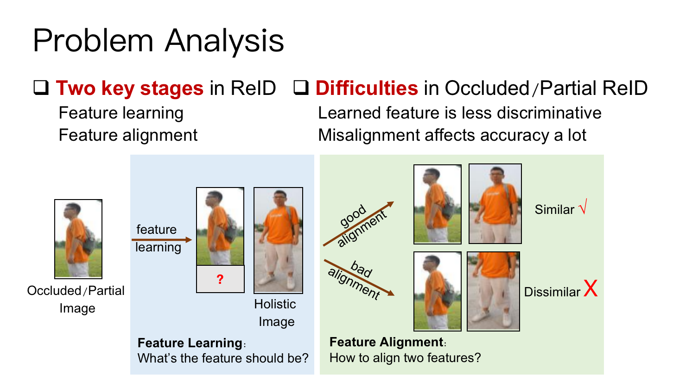

# Strong Pipeline for Occluded/Partial Re-ID 

This project provides a simple but strong Re-ID pipeline for occluded/partial Re-ID.

The pipeline achieves very high accuracy on three popular occluded/partial datasets, 
includes Occluded-ReID, Partial-iLIDS, Partial-ReID.

Our CVPR2020 work [HONet](http://openaccess.thecvf.com/content_CVPR_2020/html/Wang_High-Order_Information_Matters_Learning_Relation_and_Topology_for_Occluded_Person_CVPR_2020_paper.html) is based on this pipeline and achieves better accuracy,
please refer its [github](https://github.com/wangguanan/HOReID) for more details.


## What is Occluded/Partial Re-ID

Different from common Re-ID which assume query and gallery images are holistic (e.g. head, body, legs are visible),
occluded/partial Re-ID is more general which accepts partial/occluded images (only partial region is visible and the others are invisible due to outlier our occlusion) as queries.




## How to Deal with Occluded/Partial Re-ID

## Experimental Settings

Following [???], 
we train the proposed pipeline on Market-1501 dataset and 
test on three occluded/partial datasets, including 
Occluded-ReID, Partial-iLIDS, Partial-ReID.


## Prepare Datasets

Please download 
Market-1501, Occluded-ReID, Partial-ReID, Partial-iLIDs.
Links can be found [here](../reid_datasets.md).


## run

```
# train
python train.py --config_file ./config_occludedreid.yaml.yaml
``` 

```
# infer
python infer.py --config_file ./config_occludedreid.yaml --model_path /path/to/model.pth
```


## Experimental Results and Trained Models

Settings (on a MacBook Pro (Retina, 13-inch, Mid 2014))
- GPU: TITAN XP (memory 12194MB)
- CPU: 2.6 GHz Dual-Core Intel Core i5
- Memory: 8 GB 1600 MHz DDR3


<table><thead><tr><th>Methods</th><th>Backbone</th><th>Conf.</th><th>Occluded-ReID</th><th>Partial-ReID</th><th>Partial-iLIDs</th><th>Github/Model</th></tr></thead><tbody><tr><td>OONet(Ours)</td><td>ResNet50</td><td>-</td><td>72.1(64.0)</td><td>86.3(90.0)</td><td>70.6(82.0)</td><td>[model]()</td></tr><tr><td>OONet(Ours)</td><td>ResNet50-ibna</td><td>-</td><td>78.7(70.9)</td><td>85.0(90.1)</td><td>73.9(83.0)</td><td>[model]()</td></tr><tr><td>[HONet](https://openaccess.thecvf.com/content_CVPR_2020/papers/Wang_High-Order_Information_Matters_Learning_Relation_and_Topology_for_Occluded_Person_CVPR_2020_paper.pdf)</td><td>ResNet50</td><td>CVPR2020</td><td>80.3(70.2)</td><td>85.3(91.0)</td><td>72.6(86.4)</td><td>[github](https://github.com/wangguanan/HOReID)</td></tr><tr><td>[TCSDO](https://arxiv.org/abs/1907.03253)</td><td>ResNet50</td><td>ArXiv2019</td><td>73.7(67.9)</td><td>82.7(-)</td><td>-</td><td>-</td></tr><tr><td>[FPR](https://arxiv.org/abs/1904.04975)</td><td>ResNet50</td><td>CVPR2019</td><td>78.3(68.0)</td><td>81.0(-)</td><td>68.1(-)</td><td>-</td></tr><tr><td>[PGFA](https://yu-wu.net/pdf/ICCV2019_Occluded-reID.pdf)</td><td>ResNet50</td><td>ICCV2019</td><td>-</td><td>68.0(80.0)</td><td>69.1(80.9)</td><td>-</td></tr><tr><td>[VPM](https://openaccess.thecvf.com/content_CVPR_2019/papers/Sun_Perceive_Where_to_Focus_Learning_Visibility-Aware_Part-Level_Features_for_Partial_CVPR_2019_paper.pdf)</td><td>ResNet50</td><td>ICCV2019</td><td>-</td><td>67.7(81.9)</td><td>65.5(74.8)</td><td>-</td></tr><tr><td>[DSR](https://arxiv.org/abs/1801.00881)</td><td>ResNet50</td><td>CVPR2018</td><td>72.8(62.8)</td><td>50.7(70.0)</td><td>58.8(67.2)</td><td>[github](https://github.com/JDAI-CV/fast-reid/tree/master/projects/PartialReID)</td></tr></tbody></table>
