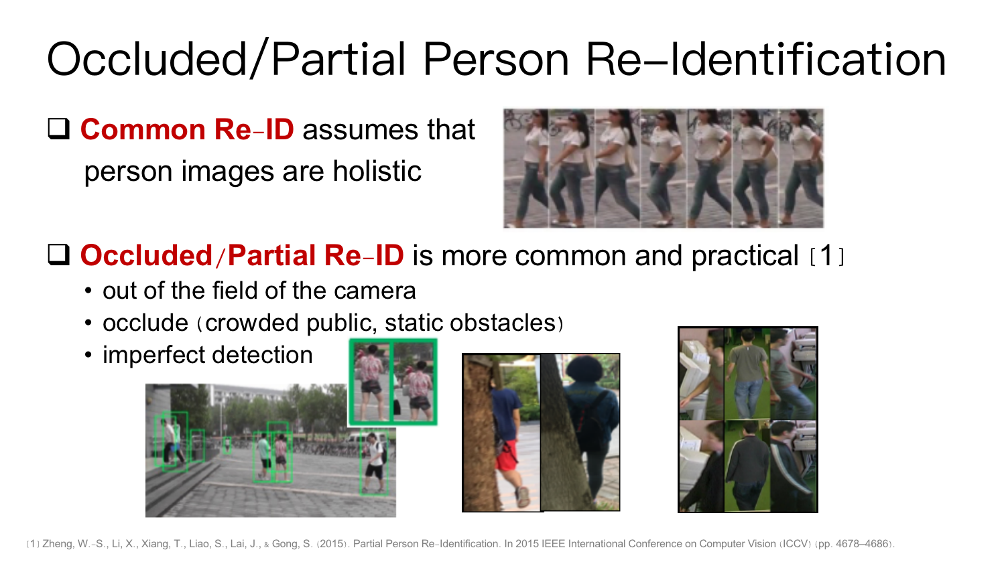

# Strong Pipeline for Occluded/Partial Re-ID 

This project provides a simple but strong Re-ID pipeline for occluded/partial Re-ID.

The pipeline achieves very high accuracy on three popular occluded/partial datasets, 
includes Occluded-ReID, Partial-iLIDS, Partial-ReID.

Our CVPR2020 work [HONet](http://openaccess.thecvf.com/content_CVPR_2020/html/Wang_High-Order_Information_Matters_Learning_Relation_and_Topology_for_Occluded_Person_CVPR_2020_paper.html) is based on this pipeline and achieves better accuracy,
please refer its [github](https://github.com/wangguanan/HOReID) for more details.


### What is Occluded/Partial Re-ID

Different from common Re-ID which assume query and gallery images are holistic (e.g. head, body, legs are visible),
occluded/partial Re-ID is more general which accepts partial/occluded images (only partial region is visible and the others are invisible due to outlier our occlusion) as queries.




### Preparation

* Please download 
Market-1501, Occluded-ReID, Partial-ReID, Partial-iLIDs.
Links can be found [here](../../reid_datasets.md).

* Please downloaed
the trained pose model [pose_hrnet_w48_256x192.pth](https://drive.google.com/drive/folders/1hOTihvbyIxsm5ygDpbUuJ7O_tzv4oXjC) 
and set [yaml files](./configs) ```model.head.pose_model_path``` to be your own path.


### run

```
# train
python train.py --config_file ./config_occludedreid.yaml
``` 

```
# infer
python infer.py --config_file ./config_occludedreid.yaml --model_path /path/to/model.pth
```


### Experimental Results and Trained Models

Settings (on a MacBook Pro (Retina, 13-inch, Mid 2014))
- GPU: TITAN XP (memory 12194MB)
- CPU: 2.6 GHz Dual-Core Intel Core i5
- Memory: 8 GB 1600 MHz DDR3


| Methods                                                                                                                                                                    | Backbone      | Conf.     | Occluded-ReID | Partial-ReID | Partial-iLIDs | Github/Model                                                                    |
|----------------------------------------------------------------------------------------------------------------------------------------------------------------------------|---------------|-----------|---------------|--------------|---------------|---------------------------------------------------------------------------------|
| OONet(Ours)                                                                                                                                                                | ResNet50      | -         | 72.1(64.0)    | 86.3(90.0)   | 70.6(82.0)    | [model]()                                                                       |
| OONet(Ours)                                                                                                                                                                | ResNet50-ibna | -         | 78.7(70.9)    | 85.0(90.1)   | 73.9(83.0)    | [model]()                                                                       |
| [HONet](https://openaccess.thecvf.com/content_CVPR_2020/papers/Wang_High-Order_Information_Matters_Learning_Relation_and_Topology_for_Occluded_Person_CVPR_2020_paper.pdf) | ResNet50      | CVPR2020  | 80.3(70.2)    | 85.3(91.0)   | 72.6(86.4)    | [github](https://github.com/wangguanan/HOReID)                                  |
| [TCSDO](https://arxiv.org/abs/1907.03253)                                                                                                                                  | ResNet50      | ArXiv2019 | 73.7(67.9)    | 82.7(-)      | -             | -                                                                               |
| [FPR](https://arxiv.org/abs/1904.04975)                                                                                                                                    | ResNet50      | CVPR2019  | 78.3(68.0)    | 81.0(-)      | 68.1(-)       | -                                                                               |
| [PGFA](https://yu-wu.net/pdf/ICCV2019_Occluded-reID.pdf)                                                                                                                   | ResNet50      | ICCV2019  | -             | 68.0(80.0)   | 69.1(80.9)    | -                                                                               |
| [VPM](https://openaccess.thecvf.com/content_CVPR_2019/papers/Sun_Perceive_Where_to_Focus_Learning_Visibility-Aware_Part-Level_Features_for_Partial_CVPR_2019_paper.pdf)    | ResNet50      | ICCV2019  | -             | 67.7(81.9)   | 65.5(74.8)    | -                                                                               |
| [DSR](https://arxiv.org/abs/1801.00881)                                                                                                                                    | ResNet50      | CVPR2018  | 72.8(62.8)    | 50.7(70.0)   | 58.8(67.2)    | [github](https://github.com/JDAI-CV/fast-reid/tree/master/projects/PartialReID) |
